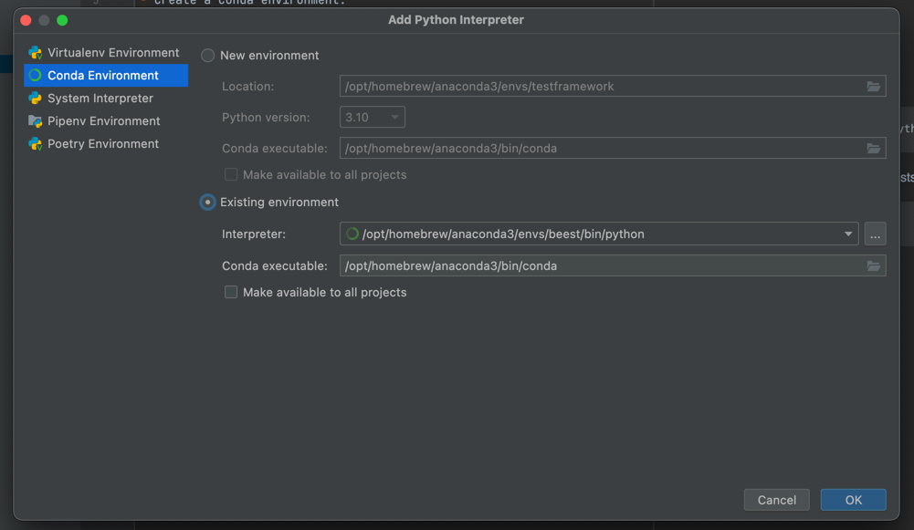

# DEVELOPMENT SETUP

## CONDA

- Create a Conda environment:
```commandline
conda create -n testframework python=3.10
```

- Install verify requirements
```commandline
pip install -r .ci-builders/beest-base/requirements-pip-verify.txt
```

- Add existing Python Interpreter (PyCharm)


