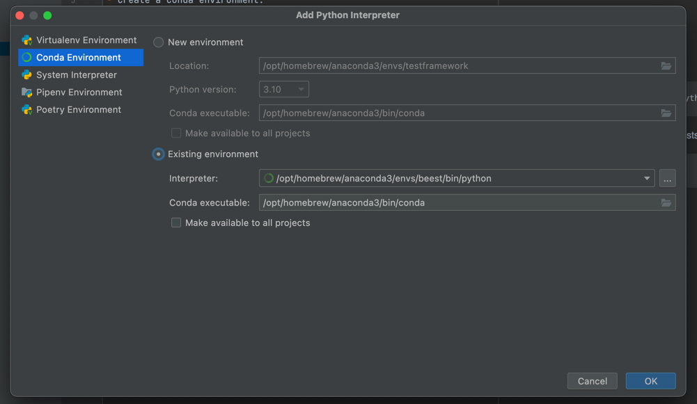

# DEVELOPMENT SETUP

## CONDA

- Create a Conda environment:
```commandline
conda create -n testframework python=3.10
```

- Install requirements (including the stscliv1 package)
```commandline
pip install -r requirements.txt
```

When adding requirements for `ststest`, remember to add it to the beest base image:
```
.ci-builders/beest-base/requirements-pip-tests.txt
```

- Add existing Python Interpreter (PyCharm)


