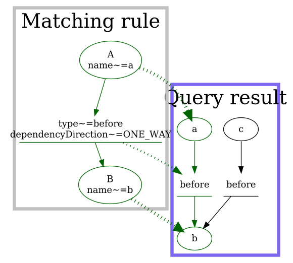
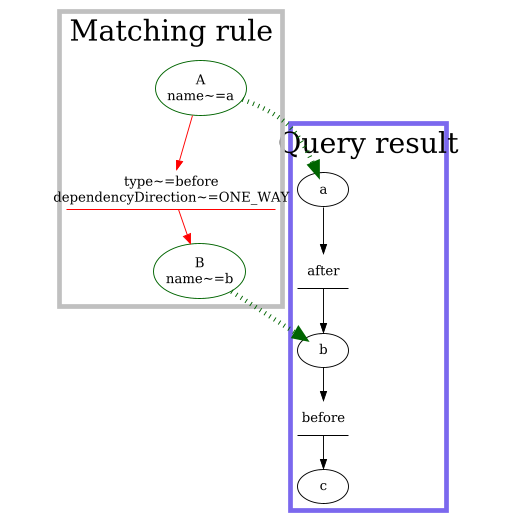
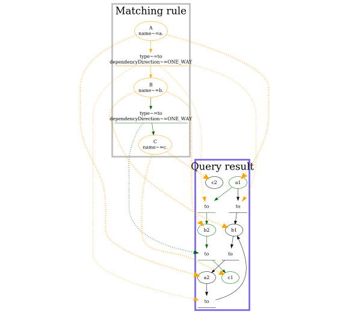
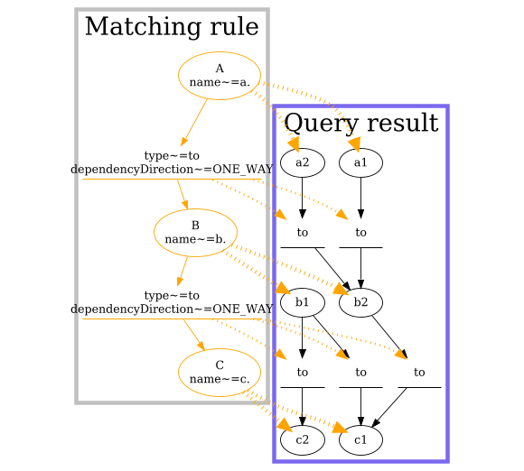

ststest
=======

Contains code to assert StackState data. Intended to be used in conjuction with (and depends on) CLIv1 (a neighboring project).


ststest.TopologyMatcher
-----------------------

`TopologyMatcher` helps to find specific components and relations in topology query result.

Usage is following:
* request a topology in StackState using CLI client
* find desired components using defined topology pattern
* examine components matching the pattern

```python
from ststest import TopologyMatcher

lambda_api_topology = \
    TopologyMatcher() \
    .component("gateway_api", name=r"^.*-rest-api$") \
    .component("gateway_stage", name=r"^(.*)-rest-api - (.*)-test$") \
    .component("gateway_resource", name=r"^/\{proxy\+\}$") \
    .component("gateway_method", name=r"^GET$") \
    .component("lambda", name=r".*-hello$") \
    .one_way_direction("gateway_api", "gateway_stage", type="has resource") \
    .one_way_direction("gateway_stage", "gateway_resource", type="uses service") \
    .one_way_direction("gateway_resource", "gateway_method", type="uses service") \
    .one_way_direction("gateway_method", "lambda", type="uses service")


def test_lambda_topology_is_present(cliv1):
    topology = cliv1.topology(
        "layer in ('Serverless') AND environment in ('Production')")
    matching_result = lambda_api_topology.find(topology)

    # assert_exact_match will throw AssertionError if no exact match found (all components and all relations)
    match = matching_result.assert_exact_match()
    # otherwise, it will return TopologyMatch object, where you can get component by a key from the definition:
    assert len(match.component('gateway_resource').attributes.get('identifiers')) > 0
```

`assert_exact_match` will also generate a matching diagram to help debugging missing components or relations.
Examples of these diagrams can be seen below. Matching diagram may be found in artifacts and in logs:
```
E       AssertionError: desired topology was not matched:
E               relation gateway_resource->gateway_method[type~=uses ser1vice,dependencyDirection~=ONE_WAY] was not found
...
INFO     root:topology_matcher.py:178 saved match in a DOT file at 12bc810870.gv
INFO     root:topology_matcher.py:187 matching diagram is available at https://tinyurl.com/265zbtvq
```

Here are some examples how matching is working, from tests in this very package:

1. Simple case

Here, the TopologyMatcher has found exact one match for every topology element.
Relations are represented by one node and two edges - it is to point a match between relation from pattern and an actual relation.



2. Relation was not matched

Here, two components were found, but the relation in between them has wrong type.



3. Many matching elements but a single match of a topology. Here is two relations - a1>b2 and a1>b1 - are matched, but a1>b1 does not lead to a complete match with B>C relation.



4. Every element has some match, but none of the matches form a desired graph A>B>C.


